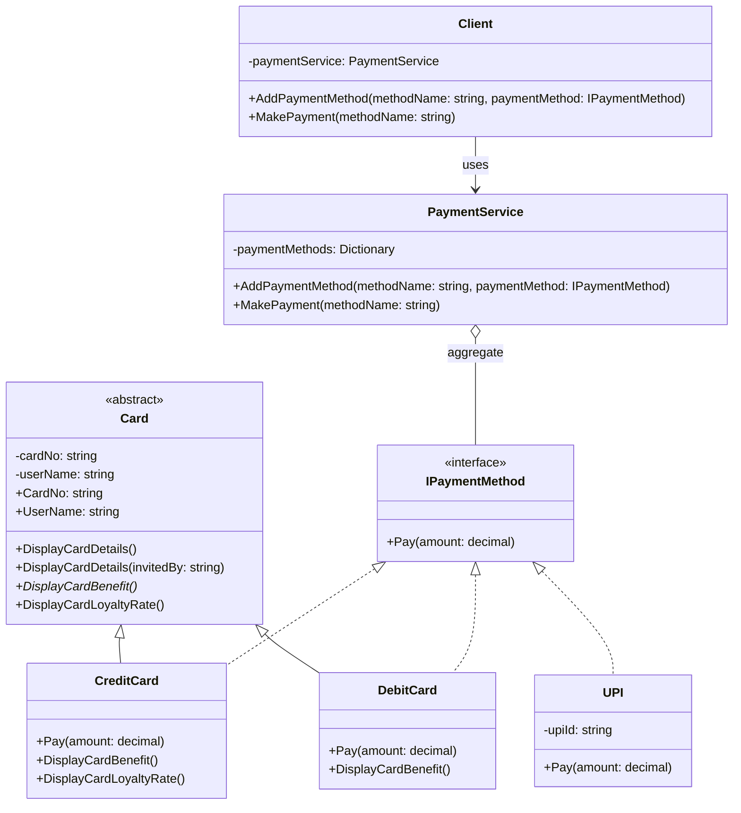

# Low Level Design Principles

Core concepts and best practices for low level designs principles, including OOP, Design Patterns, SOLID.

## Pillars of OOP

1. **Encapsulation**
   - Bundling data (properties) and methods (behavior) into a single unit (class).
   - Restricting direct access using access modifiers to protect object state.
   - Usage:
     - Getter & Setter or Property
     - Access modifier: `public`, `private`, `protected`, `internal`

   ```csharp
   // Encapsulated fields with public properties in Card.cs
   public abstract class Card(string cardNo, string userName)
   {
       private string _cardNo = cardNo;
       private string _userName = userName;

       public string CardNo { get => _cardNo; set => _cardNo = value; }
       public string UserName { get => _userName; set => _userName = value; }
   }
   ```

2. **Abstraction**
   - Hiding complex implementation details and showing only essential information.
   - Focus on what an object does, not how it does it.
   - Usage:
     - Interface: `IPaymentMethod` defines payment behavior.
     - Abstract class and abstract method: `Card` defines `DisplayCardBenefit()`.

   ```csharp
   // Abstract method in Card.cs must be implemented by derived classes
   public abstract void DisplayCardBenefit();

   // IPaymentMethod interface hides concrete implementation detail of Pay() method
   public interface IPaymentMethod
   {
       void Pay(decimal amount);
   }
   ```

3. **Inheritance**
   - Creating new classes (derived) from existing classes (base) to reuse, extend, and modify behavior.
   - Helps in code reuse and establishing relationships between objects.
   - Usage:
     - Establishes an "is-a" relationship.

   ```csharp
   // CreditCard inherits card properties and abstract methods from Card base class
   public class CreditCard(string cardNo, string userName) : Card(cardNo, userName), IPaymentMethod
   {
       public void Pay(decimal amount) { ... }
       public override void DisplayCardBenefit()
       {
           Console.WriteLine("Credit Card Benefit: Cashback on purchases.");
       }
   }
   ```

4. **Polymorphism**
   - 1 method can have multiple forms of implementation (e.g. Play() button on devices: CD, DVC, Radio, etc.)
   - Usage:

     **Compile-time Polymorphism (Method Overloading / Static / Early Binding)**
     - The computer decides the code to execute before the program run.
     - Same method name, different inputs. Compiler choose implementation.

     ```csharp
     // In Card.cs
     public void DisplayCardDetails()
     {
         Console.WriteLine($"Card Number: {CardNo}, User Name: {UserName}");
     }

     public void DisplayCardDetails(string invitedBy)
     {
         Console.WriteLine($"Card Number: {CardNo}, User Name: {UserName} invited by {invitedBy}");
     }
     ```

     **Run-time Polymorphism (Method Overriding)**
     - Derived class overrides virtual/abstract method defined in base class.
     - The compiler does not know which method will be called when it builds the project. The decision is made at run time based on the actual object created in memory.
     - Same method signature, different child classes. Runtime choose implementation.

     ```csharp
     // In Card.cs
     public virtual void DisplayCardLoyaltyRate()
     {
         Console.WriteLine($"Card Loyalty Rate: 1%");
     }

     // In CreditCard.cs
     public override void DisplayCardLoyaltyRate()
     {
         Console.WriteLine("Credit Card Loyalty Rate: 2%");
     }
     ```

     **C. Run-time Polymorphism (Interface Implementation)**
     - A single method `Pay()` can be used for difference objects, with different implementations.

     ```csharp
     // In PaymentService.cs
     // paymentMethod resolves dynamically to CreditCard, DebitCard, or UPI Pay() at runtime
     paymentMethod.Pay(100);
     ```

## UML Diagrams



### UML Notation Definitions

#### 1. Association

- **Nature:** Structural link between independent classes. One class holds reference to another.
- **Ownership:** No ownership. Peer-to-peer relationship.
- **Lifecycle:** Independent. Destroying one object does not destroy other object.
- **Example:**

  ```csharp
  public class Teacher
  {
      private Student _student;
      public Teacher(Student student) => _student = student;
  }
  ```

#### 2. Aggregation (Weak Has-A)

- **Nature:** Loose whole-part relationship. Part can exist independently outside whole.
- **Ownership:** Shared ownership. Part can belong to multiple wholes.
- **Lifecycle:** Independent. Destroying whole container leaves part intact.
- **Example:**

  ```csharp
  public class Department
  {
      private List<Teacher> _teachers;
      public Department(List<Teacher> teachers) => _teachers = teachers;
  }
  ```

#### 3. Composition (Strong Has-A)

- **Nature:** Strict whole-part relationship. Part cannot exist without whole.
- **Ownership:** Exclusive ownership. Container owns part directly.
- **Lifecycle:** Dependent. Container creates and destroys part. Destroying container destroys part.
- **Example:**

  ```csharp
  public class House
  {
      private readonly Room _room = new Room();
  }
  ```

#### 4. Dependency (Uses-A)

- **Nature:** Temporary interaction. Class uses another as method parameter, local variable, or return type.
- **Ownership:** No ownership. Transient reference only.
- **Lifecycle:** Temporary. Reference exists only during method execution scope.
- **Example:**

  ```csharp
  public class Document
  {
      public void Print(Printer printer) => printer.Print(this);
  }
  ```

#### 5. Generalization (Inheritance / Is-A)

- **Nature:** Derived class inherits attributes and behaviors from base class.
- **Ownership:** Is-a relationship. Subclass incorporates superclass state.
- **Lifecycle:** Bound together. Creating subclass instance invokes base constructor.
- **Example:**

  ```csharp
  public class Animal { }
  public class Dog : Animal { }
  ```

#### 6. Realization (Implementation)

- **Nature:** Concrete class implements contract defined by interface.
- **Ownership:** Class fulfills interface contract signature.
- **Lifecycle:** Independent instance creation, bound to interface contract at runtime.
- **Example:**

  ```csharp
  public interface IPayable
  {
      void Pay(decimal amount);
  }
  public class CreditCard : IPayable
  {
      public void Pay(decimal amount) { }
  }
  ```

## SOLID Principles
