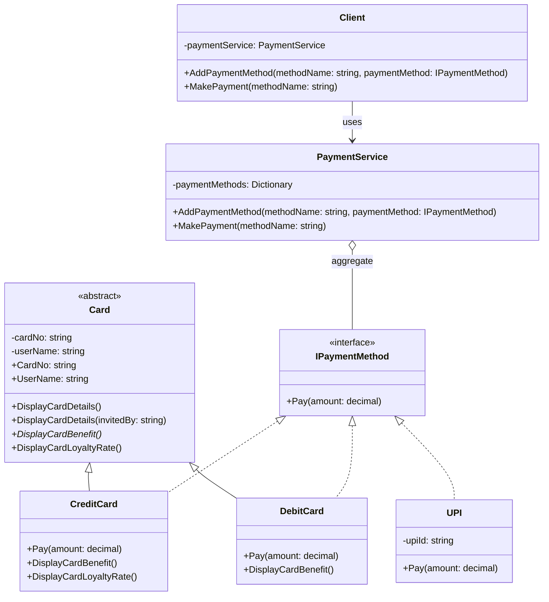

# Low Level Design Principles

Core concepts and best practices for low level designs principles, including OOP, Design Patterns, SOLID.

## Software Architecture

### Enterprise Architeture

- Structure and strategy across people, process and technology

### System Architeture

- High-level structure of a software system (infrastructure components/services)

### Application Architeture

- Internal structure of an application (classes, components, and design patterns)
- e.g. Clean Architecture, Vertical Slie Arcthiecture, etc.

## Object Oriented Programming

### 1. Encapsulation (hide internal state)

- Bundling data (properties) and methods (behavior) into a single unit (class).
- Restricting direct access using access modifiers to protect object state.
- Usage:
  - Getter & Setter or Property
  - Access modifier: `public`, `private`, `protected`, `internal`

```csharp
// Encapsulated fields with public properties in Card.cs
public abstract class Card(string cardNo, string userName)
{
    private string _cardNo = cardNo;
    private string _userName = userName;

    public string CardNo { get => _cardNo; set => _cardNo = value; }
    public string UserName { get => _userName; set => _userName = value; }
}
```

### 2. Abstraction (hide method implementation)

- Hiding implementation (method implementation) and showing only contracts (methods definition)
- Focus on what an object does, not how it does it.
- Usage:
  - Interface: `IPaymentMethod` defines payment behavior.
  - Abstract class and abstract method: `Card` defines `DisplayCardBenefit()`.

```csharp
// Abstract method in Card.cs must be implemented by derived classes
public abstract void DisplayCardBenefit();

// IPaymentMethod interface hides concrete implementation detail of Pay() method
public interface IPaymentMethod
{
    void Pay(decimal amount);
}
```

### 3. Inheritance

- Creating new classes (derived) from existing classes (base) to reuse, extend, and modify behavior.
- Helps in code reuse and establishing relationships between objects.
- Usage:
  - Establishes an "is-a" relationship.

```csharp
// CreditCard inherits card properties and abstract methods from Card base class
public class CreditCard(string cardNo, string userName) : Card(cardNo, userName), IPaymentMethod
{
    public void Pay(decimal amount) { ... }
    public override void DisplayCardBenefit()
    {
        Console.WriteLine("Credit Card Benefit: Cashback on purchases.");
    }
}
```

- **Member Hiding / Shadowing (`new` keyword)**:
  - Not polymorphism. Belongs to **Inheritance & Scope Resolution**.
  - Derived class declares a member with same name as base, hiding the base member within derived scope.
  - Resolved via **early binding / static dispatch** at compile time based on variable reference type, not actual object in memory.

  ```csharp
  // In Card.cs (base)
  public void NonVirtualDisplayCardLoyaltyRate()
  {
      Console.WriteLine("Card Loyalty Rate: 1%");
  }

  // In CreditCard.cs (derived) - hides base member
  public new void NonVirtualDisplayCardLoyaltyRate()
  {
      Console.WriteLine("Credit Card Loyalty Rate: 200%");
  }

  // Compiler binds at compile time based on variable reference type:
  Card card = new CreditCard("123", "John");
  card.NonVirtualDisplayCardLoyaltyRate(); // Output: "Card Loyalty Rate: 1%" (variable is Card -> calls Card)

  CreditCard creditCard = new CreditCard("123", "John");
  creditCard.NonVirtualDisplayCardLoyaltyRate(); // Output: "Credit Card Loyalty Rate: 200%" (variable is CreditCard)
  ```

### 4. Polymorphism

- 1 method interface, multiple concrete behaviors.
- 2 main types:

  **Compile-time Polymorphism (Method Overloading / Static / Early Binding)**
  - Compiler decides which method to call before program runs based on method signature.
  - Usage: Method Overloading (same name, different parameter types/counts).

  ```csharp
  // Method Overloading in Card.cs
  public void DisplayCardDetails()
  {
      Console.WriteLine($"Card Number: {CardNo}, User Name: {UserName}");
  }

  public void DisplayCardDetails(string invitedBy)
  {
      Console.WriteLine($"Card Number: {CardNo}, User Name: {UserName} invited by {invitedBy}");
  }
  ```

  **Run-time Polymorphism (Method Overriding / Dynamic)**
  - Derived class overrides virtual/abstract method defined in base class using `override`.
  - The compiler does not know which method will be called when it builds the project. Decision made at run time based on actual object in memory (via vtable).
  - Usage: `virtual` (base)/ `abstract` (base) + `override` (derived)

  ```csharp
  // 1. Virtual method (base) -> Override (derived)
  // In Card.cs
  public virtual void DisplayCardLoyaltyRate()
  {
      Console.WriteLine("Card Loyalty Rate: 1%");
  }

  // In CreditCard.cs
  public override void DisplayCardLoyaltyRate()
  {
      Console.WriteLine("Credit Card Loyalty Rate: 2%");
  }

  // 2. Abstract method (base) -> Override (derived)
  // In Card.cs (must have no body)
  public abstract void DisplayCardBenefit();

  // In CreditCard.cs
  public override void DisplayCardBenefit()
  {
      Console.WriteLine("Credit Card Benefit: Cashback on purchases.");
  }
  ```

  **Run-time Polymorphism (Interface Implementation)**
  - Single method contract `Pay()` implemented differently across objects. Resolved dynamically at runtime.

  ```csharp
  // In PaymentService.cs
  // paymentMethod resolves dynamically to CreditCard, DebitCard, or UPI Pay() at runtime
  paymentMethod.Pay(100);
  ```

### Common Interview Questions

1. **Encapsulation vs Abstraction**:
   - Encapsulation hides **internal data/state** (data hiding via access modifiers).
   - Abstraction hides **implementation complexity** (exposing only contract/interface).

2. **Abstract Class vs Interface**:
   - Abstract class: provides base state (fields, constructors), single inheritance, `is-a` relationship.
   - Interface: defines contracts/behavior only, multiple implementation, `can-do` relationship.

3. **`virtual` vs `abstract`**:
   - `virtual`: has default implementation in base class. Derived class can optionally override.
   - `abstract`: no implementation in base class. Derived class must override (unless abstract too).

4. **Method Overriding vs Method Hiding (`new`)**:
   - `override`: run-time binding via vtable. CLR executes method of actual object in RAM.
   - `new`: compile-time binding. Compiler executes method based on variable reference type.

5. **Method Overloading vs Overriding**:
   - Overloading: compile-time, same method name, different parameters, within same or derived class.
   - Overriding: run-time, same signature, derived class replaces base class `virtual`/`abstract` method.

6. **Favor Composition Over Inheritance**:
   - Inheritance creates tight coupling (fragile base class problem).
   - Composition allows runtime behavior changes, easier mocking, and loosely coupled parts.

## UML Diagrams

### Example Diagram



### UML Notation Definitions

#### 1. Association

- **Nature:** Structural link between independent classes. One class holds reference to another.
- **Ownership:** No ownership. Peer-to-peer relationship.
- **Lifecycle:** Independent. Destroying one object does not destroy other object.
- **Example:**

  ```csharp
  public class Teacher
  {
      private Student _student;
      public Teacher(Student student) => _student = student;
  }
  ```

#### 2. Aggregation (Weak Has-A)

- **Nature:** Loose whole-part relationship. Part can exist independently outside whole.
- **Ownership:** Shared ownership. Part can belong to multiple wholes.
- **Lifecycle:** Independent. Destroying whole container leaves part intact.
- **Example:**

  ```csharp
  public class Department
  {
      private List<Teacher> _teachers;
      public Department(List<Teacher> teachers) => _teachers = teachers;
  }
  ```

#### 3. Composition (Strong Has-A)

- **Nature:** Strict whole-part relationship. Part cannot exist without whole.
- **Ownership:** Exclusive ownership. Container owns part directly.
- **Lifecycle:** Dependent. Container creates and destroys part. Destroying container destroys part.
- **Example:**

  ```csharp
  public class House
  {
      private readonly Room _room = new Room();
  }
  ```

#### 4. Dependency (Uses-A)

- **Nature:** Temporary interaction. Class uses another as method parameter, local variable, or return type.
- **Ownership:** No ownership. Transient reference only.
- **Lifecycle:** Temporary. Reference exists only during method execution scope.
- **Example:**

  ```csharp
  public class Document
  {
      public void Print(Printer printer) => printer.Print(this);
  }
  ```

#### 5. Generalization (Inheritance / Is-A)

- **Nature:** Derived class inherits attributes and behaviors from base class.
- **Ownership:** Is-a relationship. Subclass incorporates superclass state.
- **Lifecycle:** Bound together. Creating subclass instance invokes base constructor.
- **Example:**

  ```csharp
  public class Animal { }
  public class Dog : Animal { }
  ```

#### 6. Realization (Implementation)

- **Nature:** Concrete class implements contract defined by interface.
- **Ownership:** Class fulfills interface contract signature.
- **Lifecycle:** Independent instance creation, bound to interface contract at runtime.
- **Example:**

  ```csharp
  public interface IPayable
  {
      void Pay(decimal amount);
  }
  public class CreditCard : IPayable
  {
      public void Pay(decimal amount) { }
  }
  ```

## SOLID Principles

Serve only for Loose Coupling & High Cohesion

### 1. Single Responsibility Principle (SRP)

- A class should have one, and only one, reason to change.
- Aim: High Cohesion and Loose Coupling. Avoid "God Class" that handles multiple business concerns.

#### Before

- `CommonService` mixes multiple domains: User CRUD, Customer CRUD, Email notification, SMS notification.
- Any change to email provider, SMS format, database schema, or customer rules forces change on this same class. High risk of breaking unrelated logic.

```csharp
// SOLID.S.Before/CommonService.cs - Violates SRP (God Class)
internal class CommonService
{
    void AddUser(User user) { }
    void UpdateUser(User oldUser, User newUser) { }
    void DeleteUser(string id) { }
    void AddCustomer(Customer customer) { }
    void UpdateCustomer(Customer oldCustomer, Customer newCustomer) { }
    void SendMessage(string fromEmail, string body, string toEmail, string fromNumber, string toNumber, string message)
    {
        if (!string.IsNullOrEmpty(fromEmail) && !string.IsNullOrEmpty(toEmail))
        {
            // Send email
        }

        // Send sms
    }
}
```

#### After

- Separate responsibilities into dedicated classes by business capability:
  - `UserService`: orchestrates User operations (validation, mapping, persistence call).
  - `UserRepository`: handles data persistence logic for User.
  - `CustomerService`: handles Customer domain logic.
  - `EmailService`: handles Email communication.
  - `SmsService`: handles SMS communication.

```csharp
// 1. Business domain separated: UserService.cs
internal class UserService
{
    void AddUser(User user)
    {
        // 1. Validation
        // 2. Request Cleaning
        // 3. Delegate data persistence to repository
        UserRepository userRepository = new UserRepository();
        userRepository.AddUser(user);
        // 4. Mapping Request to Response
    }
}

// 2. Persistence concern separated: UserRepository.cs
internal class UserRepository
{
    public void AddUser(User user) { /* Database access */ }
    public void UpdateUser(User oldUser, User newUser) { }
    public void DeleteUser(string id) { }
}

// 3. Customer domain separated: CustomerService.cs
internal class CustomerService
{
    void AddCustomer(Customer customer) { }
    void UpdateCustomer(Customer oldCustomer, Customer newCustomer) { }
}

// 4. Notification channels separated: EmailService.cs & SmsService.cs
internal class EmailService
{
    void SendEmail(Email email) { }
}

internal class SmsService
{
    void SendSms(Sms sms) { }
}
```

### Open/Closed Principle

- Software Entities (classes, modules, functions, etc.) should be open for extension but closed for modification.
- Adding new code rather than changing existing code.
- Things frequently changess, seperated from the part of things that don't change.
- Things that don't change, do not touch.

#### Before

- If I want to add extra payment method, i have to modify the method Pay for extra usecase
- Easily to breakdown the same method (git conflict, destroy the flow of logic, etc...)

```csharp
public enum PaymentMethod
{
    Cash = 1,
    DebitCard = 2,
    PayPal = 3,
    Unknown = 4
}

public class PaymentService
{
    public void Pay(Guid orderId, PaymentMethod paymentMethod)
    {
        switch (paymentMethod)
        {
            case PaymentMethod.Cash:
                // Process credit card payment
                break;
            case PaymentMethod.DebitCard:
                // Process debit card payment
                break;
            case PaymentMethod.PayPal:
                // Process PayPal payment
                break;
            case PaymentMethod.Unknown:
            default:
                break;
        }
    }
}
```

#### After

- Apply the Factory Pattern
- For each usecase, derived the same interface, consider as the `small gateway` to determine which object is gonna used for the payment method, determined by PaymentMethod type passed into.

```csharp
public interface IPaymentMethodHandler
{
    public void Handle();
}

public class CashPaymentMethodHandler : IPaymentMethodHandler
{
    public void Handle() { }
}

public class DebitCardPaymentMethodHandler : IPaymentMethodHandler
{
    public void Handle() { }
}

public class PayPalPaymentMethodHandler : IPaymentMethodHandler
{
    public void Handle() { }
}

public class UnknownPaymentMethodHandler : IPaymentMethodHandler
{
    public void Handle() { }
}

public interface IPaymentMethodHandlerFactory
{
    IPaymentMethodHandler GetPaymentMethodHandler(PaymentMethod paymentMethod);
}

public class PaymentMethodHandlerFactory : IPaymentMethodHandlerFactory
{
    public IPaymentMethodHandler GetPaymentMethodHandler(PaymentMethod paymentMethod)
    {
        return paymentMethod switch
        {
            PaymentMethod.Cash => new CashPaymentMethodHandler(),
            PaymentMethod.DebitCard => new DebitCardPaymentMethodHandler(),
            PaymentMethod.PayPal => new PayPalPaymentMethodHandler(),
            PaymentMethod.Unknown => new UnknownPaymentMethodHandler(),
            _ => new UnknownPaymentMethodHandler()
        };
    }
}
```

### Liskov Substitution Principle

#### Before

#### After

### Interface Segregation Principle

#### Before

#### After

### Dependency Inversion Principle

#### Before

#### After

## References

- [Practical.SOLID by phongnguyend](https://github.com/phongnguyend/Practical.SOLID)
